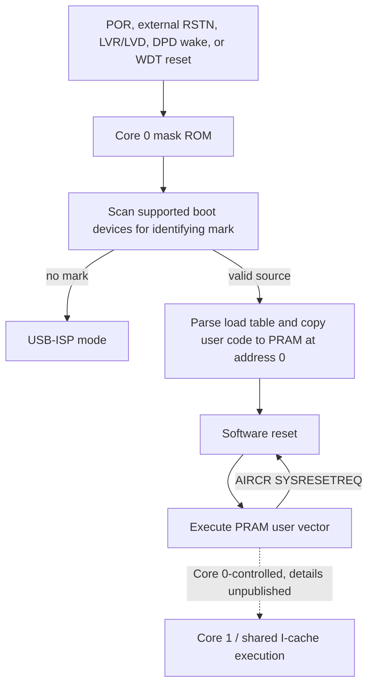

# SNC7320 boot and KB7 recovery model

Review date: 2026-08-22
Source: Sonix *SNC7320 Series Data Sheet*, revision 2.1, 1 June 2022
Source SHA-256: `d360aca16c2695f12edf91d263b2994b36edf5ad6faf130547a9220dfaca94b4`

## Outcome

Directly programming the KB7's external SPI NOR remains the strongest recovery
route because it does not require working custom firmware. The SNC73200 M1
variant contains 8 MiB of volatile SiP OPI PSRAM, not persistent firmware flash;
the SoC boots from a separate storage device (Data Sheet pp. 10, 38 and 83).

A CH341B PCB has now read the in-circuit external flash twice through flashrom.
Both complete 32-MiB reads are bit-identical. JEDEC ID `c2 20 19` identifies a
Macronix `MX25L25635F/MX25L25645G`; status `0x00` showed block protection, WEL
and WIP clear. The board was later measured at approximately 5 V on CS and is
not safe for further direct use with this 3.3-V flash without level translation.

An ESP32-C3 SPI repair subsequently restored normal stock boot. Boot was
unreliable while the unpowered programmer remained connected and recovered when
it was physically disconnected. This proves one external write/recovery event,
not a repeatable byte-identical full-chip restore procedure.

The board pad labeled `MCU_RST` is a strong candidate for active-low `RSTN`,
which is package lead 88 on the presumed SNC73200 LQFP128. It measured about
3.2 V released and 0.2 V when grounded through 1 kΩ during the successful reads.
Continuity to lead 88 must still be measured with power removed (pp. 11 and 21).

This document is a recovery design and validation checklist, not permission to
flash the current prototype.

## Boot and reset state model

The ROM scan and load-table path are documented on p. 44. Reset destinations
are documented on p. 43. The search order, identifying bytes, load-table
format, USB identity/protocol, second-core release fields, and failure behavior
for a partly corrupt valid container are not published.

The key correction is the PRAM loop: an ARM AIRCR software reset restarts PRAM,
not mask ROM. A mailbox flag plus `SYSRESETREQ` therefore cannot be called a
proven loader-entry path. The public `kb7_enter_loader()` compatibility helper
now records the recovered request marker and parks with interrupts disabled for
an external reset; it no longer issues the misleading software reset.

## Recovery layers

| Layer | What the datasheet establishes | KB7 status |
|---|---|---|
| External SPI-NOR programmer | External XIP window, SFC controller, 1/2/4-bit reads, 1/4-bit writes, and common command families (pp. 37–39) | Two identical full reads and one successful ESP32-C3 stock repair/boot; repeatable bit-identical full restore remains unproved |
| External `RSTN` | Release restarts through ROM; SNC73200 lead 88 (pp. 21 and 43) | `MCU_RST` voltage behavior and read isolation are demonstrated; physical continuity/waveform remain unverified |
| ROM USB-ISP | ROM enters it when no boot identifying mark is found (p. 44) | Identity/protocol and behavior with a corrupt-but-present identifying mark remain unknown |
| Preserved flash loader | Recovered loader is separate from mask ROM | Observed over USB as `10f5:5037` mass-storage/SCSI mode; a guarded two-stage write-path experiment is included, but it is unvalidated and is not a supported USB flasher |
| SWD | One SWD port; SNC73200 SWO/SWCLK/SWDIO are leads 11/12/13 (pp. 1, 11 and 19) | Connect-under-reset and core visibility are untested; no erase operation is authorized |
| Watchdog reset | Underflow can reset through ROM; WDT uses the 32-kHz ILRC (pp. 43 and 57–58) | Potential autonomous ROM route, but usable register fields are absent from this data sheet |
| Software reset | Restarts PRAM (p. 43) | Explicitly not a loader recovery route |

## External flash and reset pins

The default SFC-capable group for SNC73200 is (pp. 20, 22, 24 and 27–28):

| Signal | SoC pad | Package lead |
|---|---|---:|
| chip select | P0.8 | 110 |
| clock | P0.9 | 42 |
| MISO / IO1 | P0.10 | 119 |
| MOSI / IO0 | P0.11 | 39 |
| IO2 / write protect | P0.12 | 121 |
| IO3 | P0.13 | 44 |

These are SoC capabilities, not proof of KB7 PCB continuity. P0.12 is also the
recovered touch interrupt. Before quad-SPI is assumed, determine whether the
flash uses only a single/dual data path or whether board-level isolation or
time multiplexing exists.

## Safe validation order

### With power removed

1. Photograph the complete SoC and flash markings, pin-1 indicators, board
   revision, and both PCB sides.
2. Confirm continuity from `MCU_RST` to SNC lead 88 and identify a known ground.
3. Map all flash pins to the SoC-capable SFC leads and record series resistors,
   buffers, level shifters, test pads, and other bus masters.
4. Check resistance from the flash supply to the board's candidate 3.3-V and
   1.8-V rails; do not infer voltage from package style.
5. Prefer nearby passives/test pads over probing the 0.4-mm-pitch SoC leads.

### Under current-limited stock power

1. Measure the SoC I/O, core, and OPI rails. Nominal values are 3.30 V, 1.22 V,
   and 1.82 V (p. 79).
2. Measure `MCU_RST` released voltage and observe whether grounding it asserts
   reset without excessive current. A temporary series resistor is safer than
   an unexplained hard short until the reset circuit is traced.
3. Assert reset before applying USB power. Verify with an oscilloscope or logic
   analyzer that SFC chip select, clock, and data lines are inactive before
   attaching a programmer.
4. If USB powers the board, disconnect the programmer's target-VCC output.
   Connect only common ground and voltage-compatible logic signals. Do not let
   two supplies drive the same rail.
5. Do not power only the flash on an otherwise unpowered board unless its rail
   and signal paths are isolated; protection structures can back-power the SoC.
6. Disconnect an ESP32 or other programmer completely before boot unless its
   unpowered pins are proven high-impedance; the KB7 failed to boot reliably
   while an unpowered ESP32-C3 remained attached to the SFC lines.

The power-up requirement is that VDDC be above 1.2 V for the run transition and
VDDIO33 exceed 1.8 V before RSTN reaches 1.8 V (p. 81). Holding reset low while
board rails rise is consistent with that requirement, but it does not validate
the KB7's regulator or supervisor circuitry.

### Read-only programmer proof

Steps 1–3 below have now been substantially completed for the 32-MiB main array;
the canonical evidence is in `FULL-FLASH-ACQUISITION-2026-08-22.md`. Flashrom
warns that the chip's OTP area is not included in a normal read.

1. Read and record JEDEC ID, status/configuration registers, block protection,
   quad-enable state, and 3-byte/4-byte address mode.
2. Read the complete chip at least twice without writing and require identical
   cryptographic hashes.
3. Store two independent raw backups plus metadata. A full recovery image must
   retain the identifying mark, load table, loader, application regions,
   configuration/calibration, vendor assets, and erased padding—not merely the
   extracted PRAM/I-cache payloads.
4. Demonstrate a complete restore and byte-for-byte readback on a spare or
   otherwise safely recoverable setup before any custom image experiment.
5. Use bounded sector-aware read-modify-write operations; never use whole-chip
   erase for initial work.

## What can still defeat direct recovery

Direct programming bypasses broken PRAM code, USB, clocks, display, and the
software reset path. It does not solve:

- the wrong programmer voltage or unsupported flash command/address mode;
- bus contention because reset did not actually isolate the SoC;
- another powered device sharing the flash bus;
- rail back-powering or ground/reference mistakes;
- a physically damaged or locked flash chip;
- a bad backup or incomplete boot container; or
- releasing reset into an image whose early execution damages hardware.

The successful ESP32-C3 repair is now a real recovery result. A release-quality
recovery gate still requires that result to be repeatable: restore a stock image,
read it back identically, disconnect every programmer signal, and boot normally.

## Missing information to collect

- complete SoC and flash markings and clear PCB photographs;
- `MCU_RST` to lead-88 continuity and reset/SFC-idle waveform;
- exact flash rail, configuration/security/OTP state, 4-byte address behavior,
  and SFC wiring width;
- a documented repeatable full stock restore plus exact post-restore hash;
- passive SFC capture during stock boot and update;
- SWD accessibility/core routing under reset;
- USB-ISP identity and protocol;
- ROM-entering watchdog/remap register semantics from `SNC7320_reg_vx.xx` or
  independently validated stock-code recovery; and
- whether the mailbox request marker survives each ROM-entering reset and is
  actually consumed by the preserved loader.
